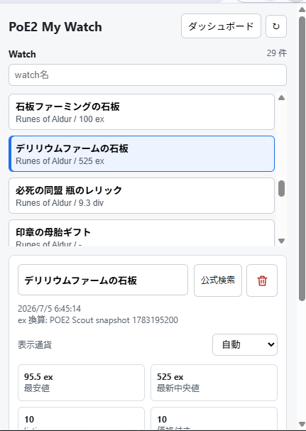
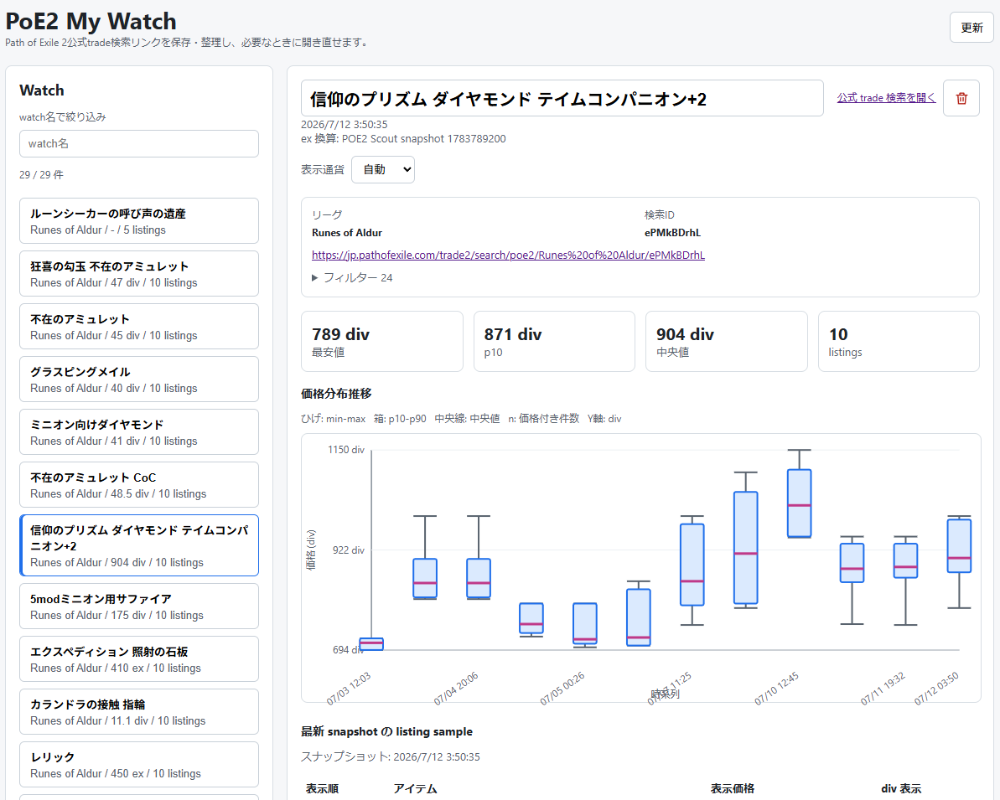

  

# PoE2 My Watch

[English](./README.md) | **日本語**

PoE2 My Watchは、Path of Exile 2公式トレード検索リンクを保存・整理するためのChrome拡張です。検索ごとに分かりやすい名前を付け、整理し、必要なときに元の公式トレードページを開き直せます。

保存した検索には任意で価格snapshotを付加でき、相場の変化を後から確認できます。

## できること

- 公式PoE2トレード検索をwatchとして保存する。
- watch名を編集し、重要な検索を見つけやすくする。
- ダッシュボードとpopupのwatch一覧をwatch名の一部で絞り込む。
- league、query ID、元リンク、取得できたfilter概要を確認する。
- popupまたはダッシュボードから元の公式トレード検索を開く。
- 不要なwatchと、付加された保存済み履歴をまとめて削除する。
- 任意で、登録済みwatchに一致する公式トレードページのタブ名をwatch名へ変更する。全体設定はデフォルトでONで、必要ならOFFにできる。
- 任意で、直近の中央値、listing件数、価格分布を比較する。
- 任意で、watchごとに表示通貨を自動、Exalted、Divine、Chaos、Mirrorから選ぶ。
- ブラウザ言語に応じて英語または日本語で使う。

## スクリーンショット

### popup

  

### ダッシュボード

## インストール

1. [GitHub Releases](../../releases/latest)から`poe2-my-watch-vX.Y.Z.zip`をダウンロードします。
2. ZIPファイルを展開します。
3. ChromeまたはChromiumで`chrome://extensions`を開きます。
4. **Developer mode**を有効にします。
5. **Load unpacked**を選び、`manifest.json`が入っている展開先フォルダーを指定します。
6. 公式PoE2トレード検索ページを開きます。

## トレード検索を保存・整理する

1. 公式PoE2トレードサイトで検索を作成するか、保存したい検索を開きます。
2. 検索条件を表示します。結果がなくてもwatchを保存できます。
3. 右下の**watch保存**を選びます。
4. ブラウザのツールバーから拡張を開きます。
5. watch名を編集して分かりやすい名前を付けます。Enterを押すかフォーカスを外すと保存されます。
6. 一致するトレードタブにはデフォルトでwatch名を表示します。公式ページのタイトルを使いたい場合は、popupまたはダッシュボードで**トレードタブにwatch名を表示**をOFFにします。
7. 元のリンクを開くときは**公式検索**を選びます。

**ダッシュボード**を開くと、保存したwatchの一覧と検索条件を確認し、必要なら価格履歴を広い画面で確認できます。

検索の準備ができると、一致するトレードタブにはwatch名が表示されます。保存したwatchに対応しないページでは公式ページのタイトルを維持します。

## 価格履歴

同じwatchを再び保存すると、履歴へ新しい観測結果が追加されます。次の情報を確認できます。

- 最新の最安値と中央値
- 表示中listing件数と価格付き件数
- popupでの直近中央値推移
- ダッシュボードでのmin、p10、中央値、p90、maxの箱ひげ図
- 最新snapshotのlisting sample

自動通貨換算を利用できない場合も、利用できる通貨で価格を確認できます。ひとつの表示通貨で比較できない履歴点は、画面上で分かるように表示します。

## 保存データについて

- watchとsnapshotは拡張内にローカル保存します。
- `POESESSID`などの公式サイト認証情報は保存・送信しません。
- 通貨換算ではleague名だけをPOE2 Scoutへ送信し、watchの内容は送信しません。
- 拡張を削除すると、保存したwatchと履歴も削除される可能性があります。

## トラブルシュート

### ボタンに「ページを再読み込み」と表示される

トレードページを開いたまま拡張がreloadされています。トレードページを再読み込みするまで、保存ボタンには**ページを再読み込み**と表示し続けます。再読み込み後に、もう一度watchを保存してください。

### 保存後にpopupが開かない

watch自体は保存されている可能性があります。Chromeがpopupの自動表示を拒否することがあるため、ブラウザのツールバーからPoE2 My Watchを開いてください。

## 現在の制約

- 更新は手動です。watchを保存した時点でページに表示中のlistingを記録します。
- snapshotは表示中listingの観測であり、市場全体を表すものではありません。
- 公式トレードページの変更により、検索条件や価格が一時的に表示されない可能性があります。
